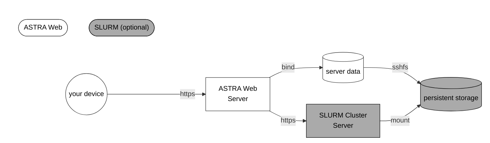

[](https://creativecommons.org/licenses/by-nc/4.0/)

# ASTRA Web API
This repository is based on [astra-web](https://github.com/AlexanderKlemps/astra-web) by A. Klemps (Hamburg University of Technology, TUHH) and contains an API wrapper for the well-known [ASTRA simulation code](https://www.desy.de/~mpyflo/) by
K. Floettmann (DESY Hamburg) based on the Python FastAPI package and Docker.

This fork includes modification for improved interoperability with a SLURM environment.

# Requirements
- Linux (kernel v6.12+)
- docker compose (v2.38+)
- python (v3.13+)
- SLURM (v0.0.40+, optional)

Older versions may work, but are not tested.

# Running Modes

The web server can be run in two modes:
- [docker](#docker) (recommended)
- [bare](#bare)

Startup and configuration of the environment variables differ slightly as explained in the following sections.

In addition, each mode can be combined with remote dispatch of some computations to a [SLURM cluster](https://slurm.schedmd.com/) for asynchronous execution. This is recommended for larger simulations. Details are explained in [SLURM](#slurm).

## Docker
Use this mode for containerized execution of the API. This is the recommended way to run the API as it ensures all dependencies are met and its kept isolated.

### Configuration
Configure the [environment](#environment) in `./docker/.env` and select your desired `COMPOSE_FILE` in `.env`.

### Build and Start
Build the image and start container by execution of the following command

    docker compose stop && docker compose up -d --build

The container will be started in detached mode. If you want to see the logs, you can run

    docker compose logs -f

To stop the container, run

    docker compose stop

note: Until explicitly stopped, the container is automatically restarted if it crashes or when the host is restarted.

### Deployment
In case you would like to deploy the API in a productive environment, say on a remote server, it is recommended to do
this via [Docker contexts](https://docs.docker.com/engine/context/working-with-contexts/).

Uncomment the `COMPOSE_FILE` environment variable in the .env file contained within this project an run

    docker context use [YOUR_REMOTE_CONTEXT]
    docker compose stop && docker compose up -d --build

## Bare
Use this mode for running the API directly on the host machine without Docker. This is useful in case docker is not available but requires manual setup of some dependencies.

### Requirements
Ensure the following dependencies are installed on your system:
- python (v3.13+)

In case you want to run ASTRA in multi-threaded mode on the local host [1] also install (see [Parallel Astra Readme](https://www.desy.de/~mpyflo/Parallel_Astra_for_Linux/AAA_Readme.txt)):
- gcc fortran (v4.8.5)
- openmpi (v4.0.3)

[1]: When using [SLURM](#slurm), the SLURM server may take care of the parallel execution in that case no additional dependencies are required.

### Configuration
Configure the [environment](#environment) in `bare/.env`.

### Start
Start the API by executing the following command in the root directory of this project:

    ./start_bare.sh

# API Documentation

Once the server is running you will find the interactive API documentation under

    http://<host>:8000/docs

where `<host>` is the URL of the host where the server is running. If you are running it locally (docker or bare), this will be `localhost` otherwise it is the adress of the remote server.

⚠️ All communication with the host is done via HTTP which provides **no encryption**! Allways route your trafic through a secure connection like a VPN or SSH tunnel to ensure your data (e.g. tokens) is protected!

# Environment

Ensure the following environment variables are set:

| Variable          | Required | Description                                                                  |
|-------------------|----------|------------------------------------------------------------------------------|
| `ASTRA_WEB_API_KEY`   | yes      | The API key to access the ASTRA web API. This is required for authorization. |
| `ASTRA_DATA_PATH` | optional | The path to a local data directory where all results are stored. If not specified an internal storage volume will be used.|
| `ASTRA_BINARY_PATH` | yes[1] | The path to the folder with ASTRA binaries. Binaries must be called `generator`, `astra` and `parallel_astra` respectively. |

- [1]: Ignored when using docker. The docker image uses its own internal binaries.

See [SLURM](#slurm) for additional environment variables required to connect to a SLURM server for remote execution.


# SLURM
If you want to dispatch some computations to a [SLURM cluster](https://slurm.schedmd.com) carefully follow the instructions below. Otherwise you can skip this section.
Using SLURM is recommended for larger simulations only.
Successful execution on the cluster and correct execution order may not be checked.

Some operations may be simple enough to be executed locally and it is recommended to **mix local and remote execution**.

> ⚠️ Connecting to SLURM requires some advanced knowledge! Check the log files of the container if you recive internal errors.


Fig. 1: Schematic overview of the ASTRA Web with SLURM support. ASTRA Web is accessed via a REST API over the https protocol. Some actions may be dispatched to a SLURM cluster for asynchronous execution via its REST API. All data is stored persistently in the cluster. Any access to the data from the server is relayed via SSHFS to the storage.

## Setup
1. Ensure `docker-compose.slurm.yml` is included in your docker compose setup. (e.g. in `.env` under `COMPOSE_FILE`)

2. Set the following environment variables (e.g. in `./docker/.env`):

| Variable                      | Required | Description                                                                        | Example                                               |
|-------------------------------|----------|------------------------------------------------------------------------------------|-------------------------------------------------------|
| `SLURM_BASE_URL`                   | yes      | The URL of the [SLURM REST API](https://slurm.schedmd.com/rest_api.html).          | `https://slurm-rest.example.com/sapi`   |
| `SLURM_API_VERSION` [0]       | yes      | The version of the SLURM REST API to use.                                          | `v0.0.40`                                            |
| `SLURM_PROXY` [1]             | optional | The URL of a SOCKS5 proxy to connect to the SLURM REST API.                        | `socks5h://host.docker.internal:1081`                 |
| `SLURM_USER_NAME`             | yes      | The SLURM user name.                                                               | `<user>`                                              |
| `SLURM_USER_TOKEN` [2]          | yes      | The [JWT token](https://slurm.schedmd.com/jwt.html) to authenticate the SLURM user.|                                                 |
| `SLURM_PARTITION`             | yes      | The SLURM partition to use for the job.                                            | `short`                                              |
| `SLURM_CONSTRAINTS`           | optional | The SLURM constraints to use for the job. This is a comma-separated list of constraints. | `gpu,highmem`, `none` |
| `SLURM_ENVIRONMENT` [3]       | yes      | The environment variables to set for the SLURM job.                                |`"PATH=/bin:/usr/bin/:/usr/local/bin/","MORE="values"` |
| `SLURM_ASTRA_BINARY_PATH` [4] | yes      | The path to the ASTRA binary **as seen by the SLURM cluster!**                     | `/home/<user>/astra/bin`                              |
| `SLURM_DATA_PATH` [5]         | yes      | The path to the data directory **as seen by the SLURM cluster!**                   | `/home/<user>/astra/data`                             |
| `SLURM_OUTPUT_PATH` [6]       | optional | The path to a directory where the slurm output should be written to (relative to the cwd or absolute). | `/home/<user>/slurm` or `../slurm`|
| `SLURM_SCRIPT_SETUP` | optional | A BASH script fragment to be executed inside the job script before each dispatched command. | `module purge\nmodule load openmpi` |

- [0]: A complete example URL of an endpoint is `https://slurm-rest.example.com/sapi/slurm/v0.0.40/jobs`.
- [1]: In case the SLURM server is not reachable from the local host and requires a tunnel. See section on [Using a Proxy](#using-a-proxy).
- [2]: The **⚠️SLURM token may expire⚠️** due to limited a lifetime. Make sure to refresh it regularly via the endpoint `slurm/configuration`.
- [3]: List of quoted strings separated by commas without spaces! Escaping commas inside strings is not possible!
- [4]: Ensure the versions of ASTRA match your local ones and the **⚠️binaries are renamed to [`astra`](https://www.desy.de/~mpyflo/Astra_for_64_Bit_Linux/) and [`parallel_astra`](https://www.desy.de/~mpyflo/Parallel_Astra_for_Linux)⚠️**.
- [5]: The paths for these files will most likely differ from the local paths on your machine. It is important that your local paths bind to the same directories as for the remote host as described in [Mount Data Directory](#mount-data-directory).
- [6]: The output of the SLURM job itself is allways separated from the output of the ASTRA computations and may be ignored. This keeps the output files from ASTRA clean and independent of the execution host.

## Mount Data Directory
This step is critical to ensure local and remote execution work together seamlessly.

Mount the remote data directory as following:

```bash
sshfs -o idmap=user -o allow_other <user>@<bastion_host>:<SLURM_DATA_PATH> <ASTRA_DATA_PATH>
```

> ⚠️ Mount your data folder directly under `ASTRA_DATA_PATH` as shown above. **Do not mount a parent folder** as docker then cannot access the files for technical reasons.

## Using a Proxy
Consider using a VPN if you can to avoid this step.

If you need to connect to the SLURM server which has to be accessed via an SSH tunnel, you can use the `SLURM_PROXY` environment variable to specify the SOCKS5 proxy.

Setup the tunnel via SSH as in
```bash
ssh -D 1080 -N <user>@<bastion_host>
```

Forward the port to the container via 
```bash
socat TCP-LISTEN:1081,fork TCP:127.0.0.1:1080 
```

# Troubleshooting

### Problem: Rootless containers on the remote host quit once the user terminates the ssh session.
    
This is not an issue of Docker. Linux stops processes started by a normal user if loginctl is configured to not use 
lingering, to prevent normal users to keep long-running processes executing in the system.
In order to fix the problem, one can enable lingering by executing 

    loginctl enable-linger $UID

on the remote host.
Source: [Stackoverflow](https://stackoverflow.com/a/73312070)

# Original Project

The original project his is based on can be found at:

- https://doi.org/10.5281/zenodo.12606498
- https://github.com/AlexanderKlemps/astra-web