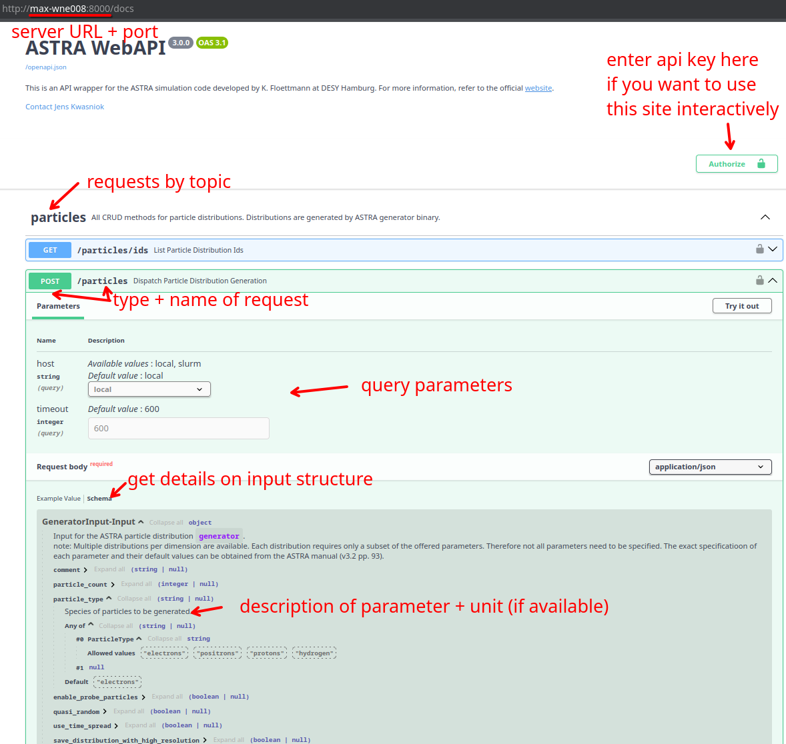
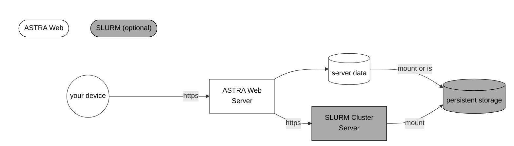

[](https://creativecommons.org/licenses/by-nc/4.0/)

# ASTRA Web API
API wrapper for the well-known [ASTRA simulation code](https://www.desy.de/~mpyflo/) by
K. Floettmann (DESY Hamburg) for enhanced management of many simulation. All simulations are managed by a server which is controlled via REST API calls.

This project is a fork of [astra-web](https://github.com/AlexanderKlemps/astra-web) by A. Klemps (Hamburg University of Technology, TUHH) which includes modification for improved interoperability with a [SLURM](https://slurm.schedmd.com) environment and more.

# Requirements
## server
- Linux (kernel v6.12+)
- python (v3.13+)
- openmpi (v5.0.3+, optional for multi-threaded simulations, ensure `libmpi_usempi.so.40` is available)
- ASTRA (v4.0, other versions are untested, will install automatically newest version if not already installed, see [Setup](#setup))
## SLURM
- SLURM (v0.0.40+, optional for remote execution on cluster)
- sshfs (optional, depending on the network infrastructure)

> ℹ️ Older versions may work, but are not tested.

# Setup
## openmpi (optional, for local multi-treaded simulations)
In case you want to run ASTRA in multi-threaded mode ensure that openmpi is installed on the server/SLURM cluster as well (see [Parallel Astra Readme](https://www.desy.de/~mpyflo/Parallel_Astra_for_Linux/AAA_Readme.txt)).

> ⚠️ Make sure that the `libmpi_usempi.so.40` is available via the `LD_LIBRARY_PATH` environment variable. E.g. create a symlink to `.../openmpi/5.0.3/lib/libmpi_usempi_ignore_tkr.so.40` in `./lib` and append `./lib` to `LD_LIBRARY_PATH`.

## Environment
The following environment variables are used.

| Variable            | Required | Description                                                                  |
|---------------------|----------|------------------------------------------------------------------------------|
| `ASTRA_WEB_API_KEY` | yes      | The API key to access the ASTRA web API. This is required for authorization. |
| `ASTRA_WEB_PORT`    | optional | The port number of the web service. Default is `8000`.                       |
| `ASTRA_DATA_PATH`   | yes      | The path to a local data directory where all results are stored.             |
| `ASTRA_BINARY_PATH` | yes      | The path to the folder with ASTRA binaries. Binaries must be called `generator`, `astra` and `parallel_astra` respectively. |
| `ASTRA_BINARY_CHECK_HASH` | optional | Whether to check the MD5 checksum of the ASTRA binaries on startup to ensure a perfectly compatible version is downloaded. Default is `false`. |

See [SLURM](#slurm) for additional environment variables required to connect to a SLURM server for remote execution.
See [BASH Environment](https://www.gnu.org/software/bash/manual/html_node/Environment.html) for how to handle an environment.

## Start
Start the server locally by executing the following command in the root directory of this project:

    ./start.sh

> ℹ️ For convenience, the environment can be written into a file at `.env`. This script will then load all (undefined) environment variables found there during startup. If desired an alternative file can be set via `ASTRA_WEB_ENV_FILE`.

> ⚠️ Communication with the server may be done via the HTTP protocol which provides **no encryption**! Always route your traffic through a secure connection like a VPN or SSH tunnel to ensure critical data (e.g. key or token) is protected!

# Example
Example notebooks demonstrating the usage of the web API can be found at [example](example).

> ⚠️ Do not forget to provide a matching environment for the examples. E.g. via `example/.env`.

# Web API Documentation

Once the server is [set up](#setup) you will find the interactive web API documentation at

    http://<host>:<port>/docs

where `<host>` is the address of the server - e.g. `localhost` when the server runs on the same machine.

## How to Use the Documentation
The documentation lists all requests by name and type.
Each request is annotated as seen in the example below.
Furthermore the schema of the input is presented with annotations for each field - including a description, a data type, a **default value**, a unit and a list of choices if applicable.



Requesting the example above may translate to the following python code based on [rest-requests](https://pypi.org/project/rest-requests):
```python
from rest_requests import request, RequestMethod

await request(
    RequestMethod.POST,
    url="https://localhost:8000/particles?host=local&timeout=1000",
    headers={"x-api-key": "<ASTRA_WEB_API_KEY>"},
    body={
        "comment": "example",
        "particle_count": 1000,
        "particle_type": "electrons",
        # ...
    },
)
```

> ℹ️ See `./alias_table.txt` (created/updated with each start of the server) for a translation of the parameter names and ASTRA mnemonics.

> ℹ️ Some parameters in the body are optional and have default values, some defaults are automatically computed internally by ASTRA. Confirm the ASTRA manual v3.2 on how these defaults are specified.

> ℹ️ In the documentation below all requests is a complete list of all input/output schemas.

# SLURM
If you want to dispatch some computations to a [SLURM cluster](https://slurm.schedmd.com) carefully follow the instructions below. Otherwise you can skip this section.
Using SLURM is recommended for resource intensive simulations only.
Fig. 1 shows a schematic overview of the extended setup.

> ⚠️ Using SLURM may lead to unexpected problems! Check the server log if any are encountered. 


Fig. 1: Schematic overview of the ASTRA Web with SLURM support. The ASTRA Web server is accessed via a REST API over the https protocol. Some actions may be dispatched to a SLURM cluster for asynchronous execution via its own REST API. All data is stored persistently in the cluster. In case the server has no direct access to the persistent storage, it has to be mounted manually (see [Mount Data Directory](#mount-data-directory)).

## SLURM Environment
In addition to the [basic environment](#environment), set the following environment variables:

| Variable                      | Required | Description                                                                        | Example(s)                                            |
|-------------------------------|----------|------------------------------------------------------------------------------------|-------------------------------------------------------|
| `SLURM_BASE_URL` [0]          | yes      | The URL of the [SLURM REST API](https://slurm.schedmd.com/rest_api.html).          | `https://slurm-rest.example.com/sapi`                 |
| `SLURM_API_VERSION` [0]       | yes      | The version of the SLURM REST API to use.                                          | `v0.0.40`                                             |
| `SLURM_PROXY_URL` [1]         | optional | The URL of a SOCKS5 proxy to connect to the SLURM REST API.                        | `socks5://localhost:8080`                             |
| `SLURM_USER_NAME`             | yes      | The SLURM user name.                                                               | `<user>`                                              |
| `SLURM_USER_TOKEN` [2]        | yes      | The [JWT token](https://slurm.schedmd.com/jwt.html) to authenticate the SLURM user.|                                                       |
| `SLURM_PARTITION`             | yes      | The SLURM partition to use for the job.                                            | `short`                                               |
| `SLURM_CONSTRAINTS`           | optional | The SLURM constraints to use for the job. This is a comma-separated list of constraints. | `gpu,highmem`                                |
| `SLURM_ENVIRONMENT` [3]       | yes      | The environment variables to set for the SLURM job.                                |`"PATH=/bin:/usr/bin/:/usr/local/bin/","MORE="values"` |
| `SLURM_ASTRA_BINARY_PATH` [4] | yes      | The path to the ASTRA binary **as seen by the SLURM cluster!**                     | `/home/<user>/astra/bin`                              |
| `SLURM_DATA_PATH` [5]         | yes      | The path to the data directory **as seen by the SLURM cluster!**                   | `/home/<user>/astra/data`                             |
| `SLURM_OUTPUT_PATH` [6]       | optional | The path to a directory where the slurm output should be written to.               | `/home/<user>/slurm` or `./slurm`                     |
| `SLURM_SCRIPT_SETUP`          | optional | A BASH script fragment to be added at the beginning of each job script.            | `module purge\nmodule load openmpi`          |

- [0]: A complete example URL of an endpoint is `https://slurm-rest.example.com/sapi/slurm/v0.0.40/jobs`.
- [1]: In case the SLURM server is not reachable from the local host and requires a tunnel. See section on [Using a Proxy](#using-a-proxy).
- [2]: The **⚠️SLURM token may expire⚠️** due to limited a lifetime. Make sure to refresh it regularly via the endpoint `/slurm/configuration/user_token`.
- [3]: List of quoted strings separated by commas without spaces! Escaping commas inside strings is not possible!
- [4]: Ensure the versions of ASTRA match your local ones and the **⚠️binaries are renamed to [`astra`](https://www.desy.de/~mpyflo/Astra_for_64_Bit_Linux/) and [`parallel_astra`](https://www.desy.de/~mpyflo/Parallel_Astra_for_Linux)⚠️ etc.**.
- [5]: The paths for these files might differ from the paths on the server. It is important that the server paths bind to the same directories as for the remote host as described in [Mount Data Directory](#mount-data-directory).
- [6]: The output of the SLURM job itself is always separated from the output of the ASTRA computations and may be ignored. This keeps the output files from ASTRA clean and automatically processable.

## Mount Data Directory
> ⚠️ This step is **critical** to ensure server and SLURM execution work together seamlessly.

For the server, mount the SLURM data directory such that the data paths align.

Example using `sshfs`:
```bash
sshfs -o idmap=user -o allow_other <user>@<slurm_host>:<SLURM_DATA_PATH> <ASTRA_DATA_PATH>
```

## Using a Proxy
When the server is located outside of the network of the SLURM cluster (and using a VPN is not an option) one can use an `ssh` tunnel to access the internal SLURM network.

Setup the tunnel via `ssh` as in
```bash
ssh -D 8080 -N <user>@<slurm_host>
```
and set the `SLURM_PROXY` [environment](#slurm-environment) variable to specify the SOCKS5 proxy.

# CLI Mode
Some commands may also be provided via the cli.

Example:

```bash
source .venv/bin/activate

export ASTRA_DATA_PATH=<ASTRA_DATA_PATH>
export ASTRA_BINARY_PATH=<ASTRA_BINARY_PATH>

python -m astra_web --help
python -m astra_web compress-sim --sim_id <SIM_ID>
```
